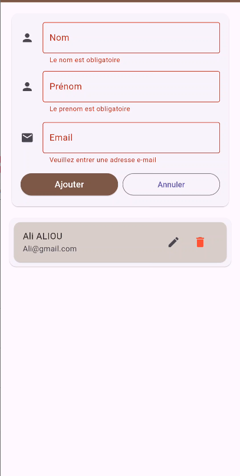
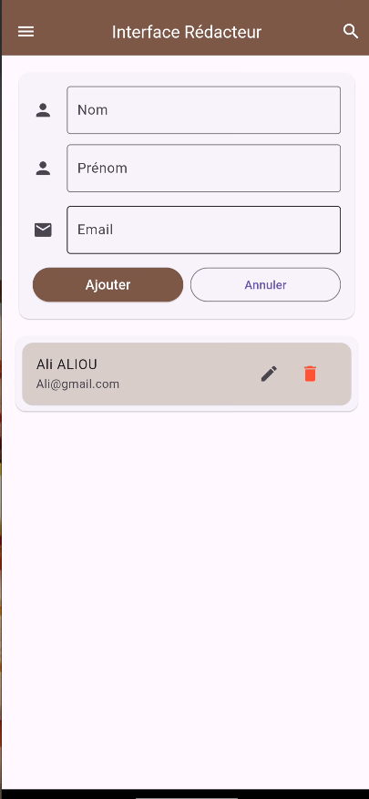
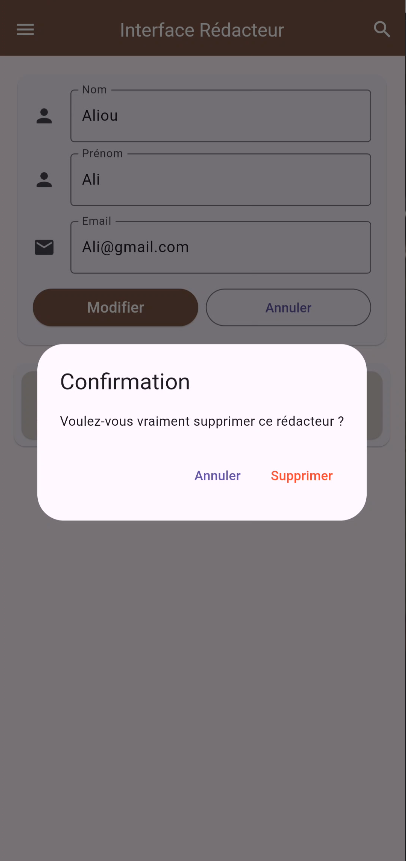

# Documentation du projet

## 1. Présentation du projet

Cette application Flutter permet de gérer une liste de rédacteurs pour un journal ou un magazine. Elle offre des fonctionnalités de création, modification, consultation et suppression de rédacteurs, avec stockage local via une base de données SQLite.

## 2. Fonctionnalités principales

- Gestion des rédacteurs
- Ajout d’un rédacteur avec nom, prénom et email
- Modification des informations d’un rédacteur existant
- Suppression d’un rédacteur avec confirmation
- Affichage d’une liste de rédacteurs
- Validation des champs de saisie

## 3. Architecture du projet

Le projet est organisé selon une architecture simple et compréhensible :

- `lib/main.dart` : point d’entrée de l’application Flutter
- `lib/views/redacteur_interface.dart` : interface utilisateur et logique de gestion des rédacteurs
- `lib/services/database_manager.dart` : accès à la base de données SQLite avec les opérations CRUD
- `lib/modeles/redacteur.dart` : modèle de données représentant un rédacteur

## 4. Base de données

L’application utilise le package `sqflite` pour stocker les données localement.

- Table : `redacteurs`
- Champs :
  - `id` : identifiant unique (entier, clé primaire auto-incrémentée)
  - `nom` : nom du rédacteur (texte, obligatoire)
  - `prenom` : prénom du rédacteur (texte, obligatoire)
  - `email` : adresse email du rédacteur (texte, obligatoire, unique)

Le gestionnaire de base de données se charge de créer la table, d’insérer, lire, mettre à jour et supprimer des rédacteurs.

## 5. Interface utilisateur

L’interface est construite autour d’un formulaire et d’une liste :

- Formulaire de saisie avec trois champs : nom, prénom et email
- Validation du formulaire avant l’ajout ou la modification
- Bouton principal qui bascule entre `Ajouter` et `Modifier` selon le contexte
- Bouton `Annuler` pour vider le formulaire et réinitialiser la sélection
- Liste des rédacteurs affichée dans des cartes
- Actions de modification et de suppression disponibles pour chaque rédacteur

## 6. Installation et exécution

### Prérequis

- Flutter installé sur la machine
- SDK Flutter configuré (`flutter doctor` doit être vert)
- Un émulateur ou appareil disponible pour l’exécution

### Commandes

- Ouvrir le projet dans un terminal :
  - `cd "c:\Users\LENOVO\Documents\D-CLICK\niveau intermediare mobile\votre repertoire\FORMATION-DCLIC-ACTIVITE-4"`
- Récupérer les dépendances :
  - `flutter pub get`
- Lancer l’application :
  - `flutter run`

## 7. Améliorations possibles

Voici des évolutions possibles pour enrichir l’application :

- Ajouter une recherche de rédacteurs par nom, prénom ou email
- Ajouter un tri des résultats (par nom ou par prénom)
- Implémenter un filtre pour les emails valides ou la première lettre du nom
- Afficher une page de détails pour chaque rédacteur
- Ajouter une pagination ou un chargement différé si la liste devient longue
- Ajouter un thème clair/sombre et améliorer le design

## 8. Annexes

### Packages utilisés

- `sqflite` : base de données SQLite pour Flutter
- `path` : gestion des chemins de fichiers

## 9. Captures d’écran

L’ajout de captures d’écran permet d’illustrer le fonctionnement de l’application et de visualiser l’interface.

Les captures à afficher sont :

- Interface avec les champs en erreur (validation du formulaire)
- 
- Page principale complète, avec le formulaire et la liste des rédacteurs
- 
- Fenêtre de confirmation de suppression
- 
- Écran de modification d’un rédacteur avec les champs pré-remplis
- 

